# LIMBERO

When using GRIEEL, refer to [LIMBERO WITH GRIEEL](#limbero-with-grieel) section for GRIEEL specific aspect and simulation.
For the set-up of ROS2 environment (including Gazebo) and some troubleshooting, refer to this section.

## Summary

[](https://github.com/Space-Robotics-Laboratory/LIMBERO/actions/workflows/build_humble.yaml)

This repository is for LIMBERO in SRL-Limb Team.

* Ubuntu 22 and ROS 2 Humble are required environment.
* PS4 controller is needed if you want to operate LIMBERO manually.
* ROS packages are written in lowercase letters and others are written in capital letters.
  * For example, `lbr_low_level_controller` is a ROS package, and `SETUP_SCRIPT` is not.

## Environment Setup

> [!IMPORTANT]
> Please refer README in develop branch because it is the latest information for setup.

Required environment is Ubuntu 22 for installing ROS 2 Humble and related modules. Ubuntu 22 on virtual environment or Docker container is not ensured to work.  
If you have not used Git on your environment, you have to install and setup Git beforehand.
You can refer to [this wiki page](https://srl.esa.io/posts/217) for setting up Git.

You can prepare environment needed for development of LIMBERO with following steps.

1. Clone LIMBERO repository

    ```bash
    $ mkdir -p ~/lbr_ws/src
    $ cd ~/lbr_ws/src
    $ git clone -b develop --recursive git@github.com:Space-Robotics-Laboratory/LIMBERO.git
    $ cd LIMBERO
    $ git status
    On branch develop
    Your branch is up to date with 'origin/develop'.

    nothing to commit, working tree clean
    ```

2. Install ROS 2 Humble

    If you have not set up ROS 2 Humble, you can set up with `install_humble.sh` in `TOOLS/SETUP_SCRIPT`. The script file is based on [official documentation](https://docs.ros.org/en/humble/Installation/Ubuntu-Install-Debians.html#ubuntu-debian-packages).

    When you run the script, **it is recommended to connect LAN cable** because it takes time to install them.

    ```bash
    cd ~/lbr_ws/src/LIMBERO/TOOLS/SETUP_SCRIPT
    bash install_humble.sh
    # You have to press Enter two times to continue this installation.
    ```

    After the installation is finished, let's try the talker and listener demo to check it completed successfully.  
    In the first terminal,

    ```bash
    source ~/.bashrc
    ros2 run demo_nodes_cpp talker
    ```

    If talker node is successfully run, you can see below messages:

    ```bash
    [INFO] [1693552353.069226373] [talker]: Publishing: 'Hello World: 1'
    [INFO] [1693552354.069247400] [talker]: Publishing: 'Hello World: 2'
    [INFO] [1693552355.069244847] [talker]: Publishing: 'Hello World: 3'
    ```

    Keeping the talker node running, let's start lister node in the second terminal.

    ```bash
    $ ros2 run demo_nodes_py listener
    [INFO] [1693552415.090892954] [listener]: I heard: [Hello World: 1]
    [INFO] [1693552416.083413710] [listener]: I heard: [Hello World: 2]
    [INFO] [1693552417.083434944] [listener]: I heard: [Hello World: 3]
    ```

    If you see listener node subscribes topics that are published by talker node, ROS 2 environment setup seems to be finished.

3. Build the whole workspace

    ```bash
    cd ~/lbr_ws
    colcon build --symlink-install
    source install/setup.bash
    ```

    **If you cannot build workspace, run the below command and try again.**

    ```bash
    rm -r ~/lbr_ws/build ~/lbr_ws/install ~/lbr_ws/log  # Delete cache files
    ```

> [!TIP]
> You can run build and source in one command using `&&`.
>
> ```bash
> colcon build --symlink-install && source install/setup.bash
> ```

## Development

### [Optional] Install Visual Studio Code (VSC) Extensions

If you want to install extensions for VSC, you can do with following steps.

1. Open VSC
1. Click `File` -> `Open Folder`
1. Select `LIMBERO` folder
1. In Extensions tab, you can see recommended ones

Also, you check them in `extensions.json` inside `.vscode` directory.

### Code Check

This repository follows the code style and language versions for ROS 2 Humble.

You can use code check with `colcon test` and see its result. It is highly encouraged to check your code before creating pull-request to merge into develop branch.

```bash
cd ~/lbr_ws
colcon test && colcon test && colcon test-result --verbose
```

If you want to check only packages with `lbr_` prefix, use the below command.

```bash
colcon build --packages-select-regex 'lbr_*' && colcon test --packages-select-regex 'lbr_*' && colcon test-result --verbose
```

 See also: [Code style and language versions](https://docs.ros.org/en/humble/The-ROS2-Project/Contributing/Code-Style-Language-Versions.html#code-style-and-language-versions)

### Debug

`backward_ros` is useful for debugging. You can use it with below command:

```bash
colcon build --symlink-install --cmake-args -DCMAKE_BUILD_TYPE=Debug
```

## Tutorial

### Run Your Code in Simulation

You can check your software implementation using Gazebo simulation. The below command launches all nodes needed for the simulation.

```bash
# First terminal
ros2 launch ~/lbr_ws/src/LIMBERO/TOOLS/LAUNCH/lbr_gazebo.launch.py
```

After Gazebo is started, you have to start `lbr_command_interface` to send command.

```bash
# Second terminal
ros2 run lbr_command_interface lbr_command_interface
```

Then, you can see commands list on terminal and some instruction. Let's open the third terminal and send command `initialize` to set LIMBERO as initial pose.

Also, you can operate LIMBERO using PS4 controller. See details below:

* OPTION button initializes the robot pose
* Right buttons are used to select one of limbs
* Left joy stick is used to move a limb in x-y direction
* L1/L2 buttons are used to move a limb in z direction
* Tilting both joy sticks makes base translation motion in x-y direction
* Pressing L1 & R1 or L2 & R2 makes base translation motion in z direction

If you do not want to launch Gazebo simulation, please use `rviz_debug.launch.py` instead of `lbr_gazebo.launch.py`.

```bash
ros2 launch ~/lbr_ws/src/LIMBERO/TOOLS/LAUNCH/rviz_debug.launch.py
```

You have to change parameters to visualize joint states in RViz. In another terminal, run the below command.

```bash
ros2 param set /LF/lbr_limb_controller rviz_debug true && ros2 param set /LH/lbr_limb_controller rviz_debug true && ros2 param set /RH/lbr_limb_controller rviz_debug true && ros2 param set /RF/lbr_limb_controller rviz_debug true
```

### Run Your Code with LIMBERO

The below command launches all nodes needed to move LIMBERO.

```bash
ros2 launch ~/lbr_ws/src/LIMBERO/TOOLS/LAUNCH/limbero.launch.py
```

As same as Gazebo simulation, you have to run `lbr_command_interface` to send commands.

## Trouble-Shooting

**Please add information if you solve troubles about this repository.**

### Fail to build dynamixel_sdk

Confirm you are in `ros2` branch in DynamixelSDK. You may be needed to clear cache after checking out `ros2` branch.

### Dynamixels are not detected

Confirm all cables are connected correctly, or see the emergency stop button is not pushed.
If hardware settings are correct, check source codes, for example baudrate, Dynamixel IDs, or port settings. (See `lbr_dynamixel_controller`)

Also, you have to check the ports are specified correctly.
The default code sets LF as `/dev/ttyUSB0`, LH as `/dev/ttyUSB1`, RH as `/dev/ttyUSB2`, and RF as `/dev/ttyUSB3`.
You can set them by unplugging all then re-plug from LF to RF.

### PS4 controller is not detected

Confirm read/write access for port such as `/dev/ttyACM0` or `/dev/ttyUSB0` with below command.

```bash
$ ls -l /dev/ttyACM* /dev/ttyUSB*
crw-rw---- 1 root dialout 166, 0 Aug 18 15:50 /dev/ttyACM0  # This doesn't have access
crw-rw-rw- 1 root dialout 166, 0 Aug 18 15:50 /dev/ttyACM0  # This is OK
```

You can change the permission using `chmod`.

```bash
sudo chmod 666 /dev/ttyUSB* /dev/ttyACM*
```

### Gazebo does not launched with following error messages

```bash
[spawner-6] [INFO] [1705979024.982934819] [spawner_joint_state_broadcaster]: Waiting for '/controller_manager' node to exist
[spawner-5] [INFO] [1705979024.987846261] [spawner_joint_trajectory_controller]: Waiting for '/controller_manager' node to exist
[spawner-6] [INFO] [1705979026.998388349] [spawner_joint_state_broadcaster]: Waiting for '/controller_manager' node to exist
[spawner-5] [INFO] [1705979027.001791117] [spawner_joint_trajectory_controller]: Waiting for '/controller_manager' node to exist
[spawner-6] [INFO] [1705979029.012531351] [spawner_joint_state_broadcaster]: Waiting for '/controller_manager' node to exist
[spawner-5] [INFO] [1705979029.015486244] [spawner_joint_trajectory_controller]: Waiting for '/controller_manager' node to exist
[spawner-6] [INFO] [1705979031.027275114] [spawner_joint_state_broadcaster]: Waiting for '/controller_manager' node to exist
[spawner-5] [INFO] [1705979031.030469718] [spawner_joint_trajectory_controller]: Waiting for '/controller_manager' node to exist
[spawner-6] [ERROR] [1705979033.041177524] [spawner_joint_state_broadcaster]: Controller manager not available
[spawner-5] [ERROR] [1705979033.045346479] [spawner_joint_trajectory_controller]: Controller manager not available
[ERROR] [spawner-6]: process has died [pid 14647, exit code 1, cmd '/opt/ros/humble/lib/controller_manager/spawner joint_state_broadcaster --controller-manager /controller_manager --ros-args'].
[ERROR] [spawner-5]: process has died [pid 14645, exit code 1, cmd '/opt/ros/humble/lib/controller_manager/spawner joint_trajectory_controller --controller-manager /controller_manager --ros-args'].
```

Try this command:

```bash
source /usr/share/gazebo/setup.bash
```

The log file of Gazebo would be also helpful for debugging. (stored in `/home/<user_name>/.gazebo/client-11345/default.log`)

### Can't display the robot model in gazebo

Check your environmental condition

```bash
gzserver --verbose
```

If you get this error, your gzserver  have already opened.

```bash
[Err] [Master.cc:96] EXCEPTION: Unable to start server[bind: Address already in use]. There is probably another Gazebo process running.
```

You have to kill previous connection.

```bash
killall gzserver
```
If it doesn't work, you should try in new terminal.

## Repository Description

### Directory Structure

```bash
LIMBERO
├── CONTROL  # Contains packages related control
│   ├── lbr_dynamixel_controller
│   ├── lbr_high_level_controller
│   ├── lbr_limb_controller
│   └── lbr_low_level_controller
├── PARAM
│   ├── lbr_description
│   ├── lbr_msgs
│   └── lbr_parameter.hpp
├── PLANNER  # Contains packages related planning
│   └── lbr_grasping_guarantee
├── README.md
├── SLAM  # Contains packages related SLAM
│   ├── lbr_contact_determination
│   ├── lbr_state_estimator
│   └── SENSOR
├── SUBMODULE  # Submodule repositories
│   ├── DynamixelSDK
│   └── rt_usb_9axisimu_driver
└── TOOLS
    ├── CONFIG
    ├── LAUNCH  # ROS 2 launch files
    ├── lbr_command_interface
    ├── lbr_sim
    └── SETUP_SCRIPT
```

### Schematic Diagram

If you want to know more detailed structure, use `rqt_graph` after launching nodes.

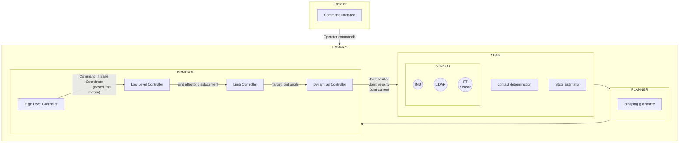

### lbr_command_interface

This package handles all of input from operators e.g. terminal commands or controller commands.

### lbr_description

This package stores URDF file or STL data for visualization and simulation.

### lbr_dynamixel_controller

This package sends command to Dynamixels and obtains Dynamixel sensor information.

### lbr_high_level_controller

High Level Controller (HLC) handles high level commands such as gait planning or base motion.
These commands are expressed in base coordinate and sent to Low Level Controller (LLC).

### lbr_limb_controller

Limb Controller (LC) subscribes target end effector pose from LLC. It solves inverse kinematics and sends commands to joints.

### lbr_low_level_controller

Low Level Controller (LLC) controls the limbs based on high level command i.e. motion package.

### lbr_msgs

This package defines the custom messages for LIMBERO.

### lbr_sim

This package is for Gazebo simulation about LIMBERO.

### lbr_state_estimator

This package estimates current robot states such as joint angle, robot position or pose.

## Author(s) and Maintainer(s)

Contributors are shown in below, and feel free to contact them if you have any interest or question.  
*Names are shown in alphabetical order.*

* Dr. Kentaro Uno (unoken at tohoku.ac.jp)
* Kazuki Takada (kazuki.takada.s2 at dc.tohoku.ac.jp)
* [OB] Masahiro Uda
* Masazumi Imai (imai.masazumi.p2 at dc.tohoku.ac.jp)
* [OB] Mikio Eguchi
* Ryo Nishibe (nishibe.ryo.q4 at dc.tohoku.ac.jp)
* Taku Okawara (okawara.taku.t3 at dc.tohoku.ac.jp)
* Teruhiro Kataonami (kataonami.teruhiro.q7 at dc.tohoku.ac.jp)
* [Intern] Tom Hauser

## Command Cheat Sheet

You can note commands here.

### Send debug command for crawl gait

```bash
ros2 topic pub --once /user_command std_msgs/msg/String '{data: Crawl_Gait_debug}'
```

### Send limb motion task form terminal

```bash
ros2 topic pub --once /lbr_high_level_controller/motion_package/limb_motion_task lbr_msgs/msg/LimbMotionTask '{limb_id: 0, swing_duration: 3000, swing_mid_point: {x: 0.0, y: 0.0, z: 0.0}, end_effector_displacement: {x: 0.0, y: 0.0, z: 0.0}, pitch_angle_displacement: 0.0}'
```

### Send base motion task form terminal

```bash
ros2 topic pub --once /lbr_high_level_controller/motion_package/base_motion_task lbr_msgs/msg/BaseMotionTask '{motion_duration: 3000, base_displacement: {x: 0.0, y: 0.0, z: 0.0}, base_angle_displacement: {x: 0.0, y: 0.0, z: 0.0}}'
```

### Send command to joint trajectory controller in ros2_control

```bash
ros2 topic pub /joint_trajectory_controller/joint_trajectory trajectory_msgs/msg/JointTrajectory '{header: {stamp: {sec: 0, nanosec: 0}}, joint_names: ["LF_B2C", "LF_C2F", "LF_F2T", "LF_T2E", "LH_B2C", "LH_C2F", "LH_F2T", "LH_T2E", "RH_B2C", "RH_C2F", "RH_F2T", "RH_T2E", "RF_B2C", "RF_C2F", "RF_F2T", "RF_T2E"], points: [{positions: [0.0, 0.0, 0.0, 0.0, 0.0, 0.0, 0.0, 0.0, 0.0, 0.0, 0.0, 0.0, 0.0, 0.0, 0.0, 0.0], velocities: [0.0, 0.0, 0.0, 0.0, 0.0, 0.0, 0.0, 0.0, 0.0, 0.0, 0.0, 0.0, 0.0, 0.0, 0.0, 0.0], accelerations: [0.0, 0.0, 0.0, 0.0, 0.0, 0.0, 0.0, 0.0, 0.0, 0.0, 0.0, 0.0, 0.0, 0.0, 0.0, 0.0], time_from_start: {sec: 1, nanosec: 0}}]}'
```

### Run `lbr_dynamixel_controller` only

You have to specify namespace of limb.

```bash
ros2 run lbr_dynamixel_controller lbr_dynamixel_controller --ros-args -r __ns:=/LF
```

### Connect SSH to Jetson Orin NX

Check network setting. If ping command works, it is fine.

```bash
$ ping 192.168.10.189
PING 192.168.10.189 (192.168.10.189) 56(84) bytes of data.
64 bytes from 192.168.10.189: icmp_seq=1 ttl=64 time=94.4 ms
64 bytes from 192.168.10.189: icmp_seq=2 ttl=64 time=15.1 ms
64 bytes from 192.168.10.189: icmp_seq=3 ttl=64 time=343 ms
64 bytes from 192.168.10.189: icmp_seq=4 ttl=64 time=69.5 ms
```

Below command is connecting SSH and `-X` is needed for using GUI on the operation machine.

```bash
sudo ssh limbero@192.168.10.189 -X
```

## Table of Dynamixel IDs

Labeled Number is defined for each Dynamixel in Limb team, and it is different from assigned ID that is used for Dynamixel recognition.

| Limb | Which part? | Dynamixel model number | Labeled No.# | Assigned ID | Control mode |
|------|-------------|------------------------|---------------|-------------|-----|
| LF   | B2C         | XM540-W270-R           | #10           | 1           | Position |
| LF   | C2F         | XM540-W270-R           | #18           | 2           | Position |
| LF   | F2T         | XM430-W350-R           | #11           | 3           | Position |
| LF   | T2G         | XM430-W350-R           | #12           | 4           | Position |
| LF   | Gripper     | XC330-T288-T           | #33           | 5           | Current |
| LH   | B2C         | XM540-W270-R           | #24           | 6           | Position |
| LH   | C2F         | XM540-W270-R           | #25           | 7           | Position |
| LH   | F2T         | XM430-W350-R           | #28           | 8           | Position |
| LH   | T2G         | XM430-W350-R           | #27           | 9           | Position |
| LH   | Gripper     | XC330-T288-T           | #32         | 10          | Current |
| RH   | B2C         | XM540-W270-R           | #22           | 11          | Position |
| RH   | C2F         | XM540-W270-R           | #23           | 12          | Position |
| RH   | F2T         | XM430-W350-R           | #30           | 13          | Position |
| RH   | T2G         | XM430-W350-R           | #9            | 14          | Position |
| RH   | Gripper     | XC330-T288-T           | #34         | 15          | Current |
| RF   | B2C         | XM540-W270-R           | #20           | 16          | Position |
| RF   | C2F         | XM540-W270-R           | #21           | 17          | Position |
| RF   | F2T         | XM430-W350-R           | #26           | 18          | Position |
| RF   | T2G         | XM430-W350-R           | #29           | 19          | Position |
| RF   | Gripper     | XC330-T288-T           | #35         | 20          | Current |

---

# LIMBERO WITH GRIEEL

### (Reffer to this part of documentation when Grieel is used as end-effector)


Image from Gazebo simulation with mars world environment

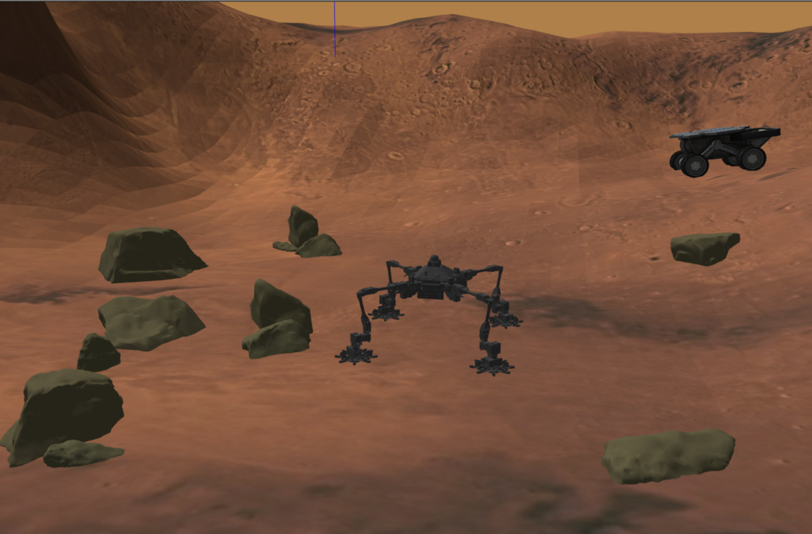

GRIEEL module in the two configurations

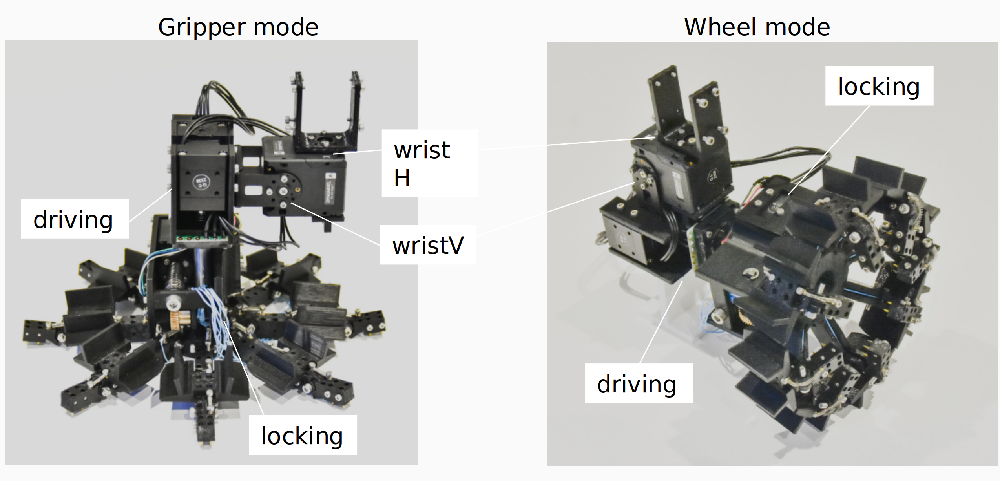

---

## TUTORIAL

> [!IMPORTANT]
> To use Grieel related code, be sure that your LIMBERO code is up to date with `feature/implementGrieelStability`.
> For any question, you can write me (Alessandro Puglisi, COLABS M2, SRL) on slack.

> [!WARNING]
> PLEASE, Don't commit and push on this branch until march 2025, I'm working on my master Thesis and I need to update some part of the code. 

### SIMULATION

In order to launch Gazebo simulator with all the control nodes, open the terminal and go to **~/lbr_ws/src/LIMBERO/TOOLS/LAUNCH** directory (launcher is not installed in the ros2 workspace, it is not part of any package, so you have to go directly to its location to launch it.).
```bash
# First terminal
cd ~/lbr_ws/src/LIMBERO/TOOLS/LAUNCH
```
Once in this directory, use below command:

**Simulation in wheel mode:**
```bash
# First terminal
ros2 launch lbr_gazebo.launch.py wheel_mode:=true
```
( you can omit `wheel_mode:=true`, it is the default option)

**Simulation in Gripper mode:**
```bash
# First terminal
ros2 launch lbr_gazebo.launch.py wheel_mode:=false
```
( in gripper mode, `wheel_mode:=false` is needed for proper URDF model load)

> [!NOTE]
> `wheel_mode:=<true/false>` is used to load the proper robot model ([URDF](https://docs.ros.org/en/humble/Tutorials/Intermediate/URDF/URDF-Main.html)).
> **wheel_mode** is a launch argument, which is passed towards the chain of launches called by `lbr_gazebo.launch.py`.
> This is used both for internal parameter initialization (information on initial Grieel configuration is needed by controllers), and for proper [xacro](https://docs.ros.org/en/humble/Tutorials/Intermediate/URDF/Using-Xacro-to-Clean-Up-a-URDF-File.html) parsing (xacro if/unless condition allow to change URDF configuration).

> [!NOTE]
> To investigate the xacro file related to Limbero+Grieel software, look into xacro files `~/lbr_ws/src/LIMBERO/PARAM/lbr_description/urdf/Grieel`. If something is not clear, refer to [Software Update](#software-update) section. Notice that some xacro file are not used, just written for additional functionality, but not working.

> [!WARNING]
> Sometimes the robot doesn't spawn properly, it can be caused by gazebo itself. You can see an improper spawn when for example wristV joints are tilted, with bad posture. Just shut down with  `CTRL+C` and re-launch.
> 
> Bad Wrist configuration
> 
> 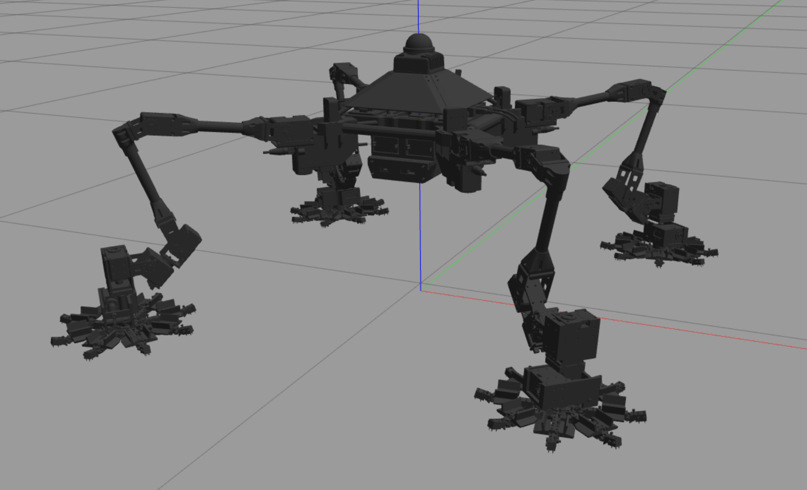
>
> Good Wrist configuration
> 
> 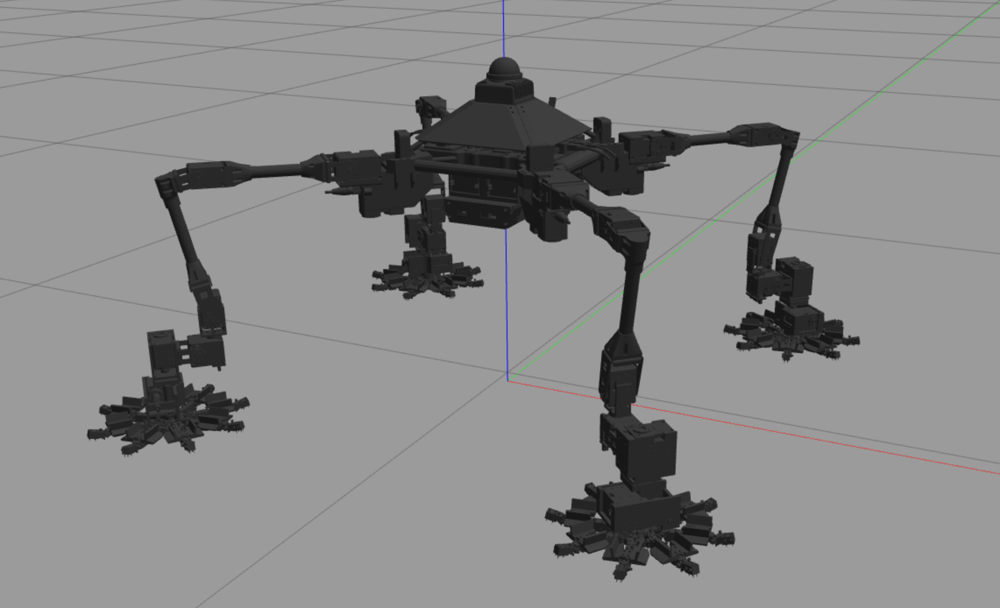


Once robot model properly spown in Gazebo (and simultaneusly rviz visualization run), in order to send command `lbr_command_interface` must be running:

```bash
# Second terminal
ros2 run lbr_command_interface lbr_command_interface
```
Now you can send commands on new terminals (by publishing messages on the proper topics) or by using a connected PS4 Joypad.

This is a simplifyed comunication architecure of the ros2 network

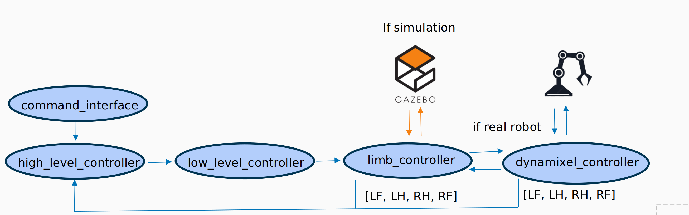

> [!WARNING]
> Before any movement and joypad commands, you need to **initialize** LIMBERO, otherwise any task will lead to robot falling down (I think this is due to some bug on low level control software).
> So, any command and motion needs to start with initialize, wich set robot base on the ground (don't panic about IK warning during initialization)

Open a new terminal to send commands:
* **LIMBERO related commands remain the same, here are resumed**
#### INITILAIZE:
```bash
# Third terminal
 ros2 topic pub --once /string std_msgs/msg/String '{data: initialize}'
```
:video_game: otherwise press **OPTION** on joypad.

#### BASE MOTION TASK
```bash
# Third terminal
ros2 topic pub --once /lbr_high_level_controller/motion_package/base_motion_task lbr_msgs/msg/BaseMotionTask '{motion_duration: 3000, base_displacement: {x: 0.0, y: 0.0, z: 0.0}, base_angle_displacement: {x: 0.0, y: 0.0, z: 0.0}}'
```
:video_game: otherwise:
* **L1&R1** for up vertical base motion (positive z base displacement)
* **L2&R2** for down vertical base motion (negative z base displacement)
* **L&R KNOB** move both knobs forward (or bakward/left/right) for planar base motion (x,y base displacement)
* **ARROWS** tilt the base around its x,y axis (x,y base angle displacement)
* **L3&R3** titlt the base around z axis (z base angle displacement)

#### LIMB MOTION TASK
```bash
# Third terminal
ros2 topic pub --once /lbr_high_level_controller/motion_package/limb_motion_task lbr_msgs/msg/LimbMotionTask '{limb_id: 0, swing_duration: 3000, swing_mid_point: {x: 0.0, y: 0.0, z: 0.0}, end_effector_displacement: {x: 0.0, y: 0.0, z: 0.0}, pitch_angle_displacement: 0.0}'
```
> [!NOTE]
> * If `swing_mid_point` is 0,0,0 the displacement motion is linear, otherwise more complex end effector trajectories can be achieved.
> * limb_id can be 0 (LF), 1 (LH), 2 (RH), 3 (RF), in anti-clockwise order from LF

:video_game: otherwise:
FIRST OF ALL, mantain pressed the button (lets call it **B**) related to the limb you want to move 
LF = SQUARE, LH = TRIANGLE, RF = X, RH = CIRCLE.
* **B&L1** move limb up (positive z end effector displacement)
* **B&L2** move limb down (negative z end effector displacement)
* **B&LeftKnob** moving left knob in the desired direction move limb in x-y direction (x,y end effector displacement)

>[!NOTE]
> x-y Limb displacement is computed in the base cohordinate (so the limb in positive x-y plane is LF).
> Sending positive x and y to LF moves away from the robot, for example {x: 0.1, y: 0.1, z: 0.0} moves with a vector of 45deg with respect to limb base, in the direction of the connection between limb frame and LF leg attachment with base.
> Instead if you are controlling LH leg,  the motion "away from the robot", in the direction of the vector connecting base frame with LH leg attachment, correspond to positive y but negative x {x: -0.1, y: 0.1, z: 0.0}. And so on..
> Figure below may help, also refer to motion package figure for understanding it.
> Base and limb Frames, limb task vector is always with respect to base frame
>
> 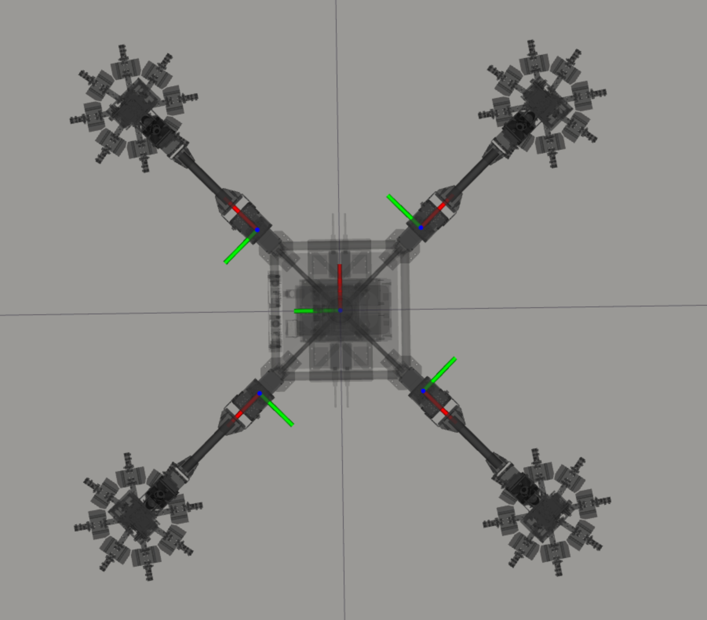
>
> Motion Task/Package graphical representation
>
> 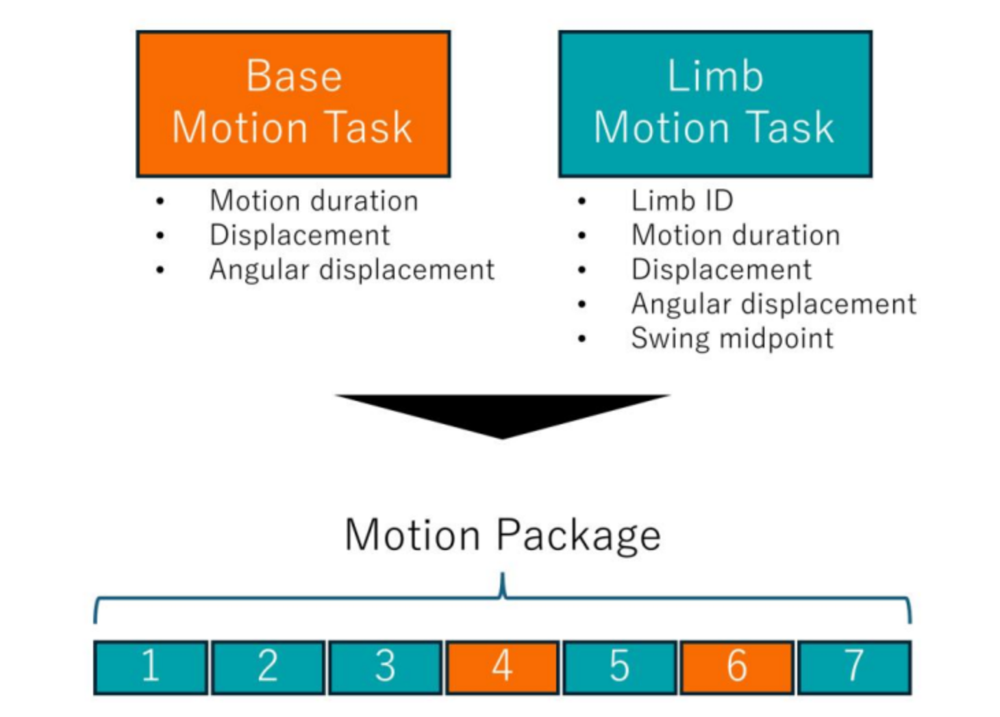


* **New GRIEEL related commands**:

#### BASE STABILIZATION

> [!IMPORTANT]
> This stabilization procedure can be executed only if all 4 feet are in contact
> 

In order to move the robot in a stable configuration before any further motion, this method callback bring base CoM in the center of support polygon. 
(This is a stable configuration in case of flat terrain, for the Static Stability criterion).

```bash
# Third terminal
 ros2 topic pub --once /string std_msgs/msg/String '{data: center_base}'
```

#### SINGLE GRIEEL MODULE TRASFORMATION

Gripper to Wheel and viceversa transition is managed by `lbr_limb_controller`, message is published by HLC, passed to LLC and than received by each LC which send the joint trajectory to ros2_controller.

The command can be also sent by the user by publishing on the proper topic from command line. 

* **GRIPPER to WHEEL**
  
simulataneusly 180deg of wristH and 90deg of wristV, then locking command to close the wires
  
```bash
# Third terminal
 ros2 topic pub --once /LF/lbr_low_level_controller/grieel_command  std_msgs/msg/String '{data: wheel}'
```
(change the namespace `/LF/` in the topic name to LH,RH,RF if you want to transform other leg Grieel)

* **WHEEL to GRIPPER**
  
same sequence as before, but in opposite direction

```bash
# Third terminal
 ros2 topic pub --once /LF/lbr_low_level_controller/grieel_command  std_msgs/msg/String '{data: gripper}'
```
(change the namespace `/LF/` in the topic name to LH,RH,RF if you want to transform other leg Grieel)

#### SINGLE GRIEEL MODULE DRIVING/STOP COMMAND

* **DRIVE**
  
To make all driving joints rotate in a direction coherent with forward driving motion (positive x axis in base frame) 

```bash
# Third terminal
 ros2 topic pub --once /string std_msgs/msg/String '{data: driving_forward}'
```
* **STOP**
  
To stop driving joints rotation 
```bash
# Third terminal
 ros2 topic pub --once /string std_msgs/msg/String '{data: stop_driving_forward}'
```

#### SINGLE GRIEEL MODULE DRIVING/STANDARD CONFIGURATION

> [!NOTE]
> This configuration transition can be launched both in gripper and wheel mode.
> 
> The "driving configuration" correspond to a wristH joint motion of 45 degrees with respect to the standard one (to position all wheel axis parallel for forward driving)

* **FROM STANDARD TO DRIVING:**
  
```bash
# Third terminal
 ros2 topic pub --once /string std_msgs/msg/String '{data: driving_forward_config_LF}'
```
For other limb configuration transition, just change LF part to LH, RH or RF:
`{data: driving_forward_config_<LF,LH,RH,RF>}`

* **FROM DRIVING TO STANDARD:**
  
```bash
# Third terminal
 ros2 topic pub --once /string std_msgs/msg/String '{data: standard_config_LF}'
```
As before, to select the proper limb transition:
`{data: standar_config_<LF,LH,RH,RF>}`

#### AUTOMATIC STABLE GRIEEL MODE TRANSITION 

> [!IMPORTANT]
> * When sending this command, all feet must be in contact with the ground.
> * If wokring in simulation, be sure that in `lbr_high_level_controller`, the related SIMULATION variable is true.
>   ```cpp
>    #define SIMULATION true
>   ```

```bash
# Third terminal
 ros2 topic pub --once /string std_msgs/msg/String '{data: grieel_mode_transform}'
```
:video_game: otherwise press **SHARE** on joypad.

> [!NOTE]
> ALGORITHM:
> High level description of the transition algorithm:
> 
> 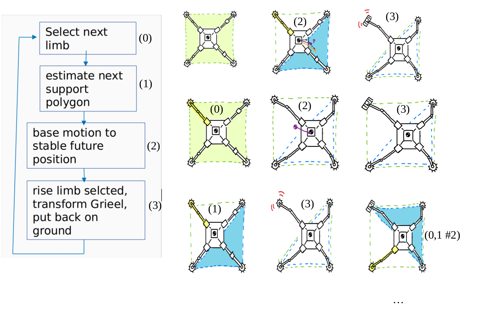
>
> How base motion is computed to keep 3-foot stability:
> 
> 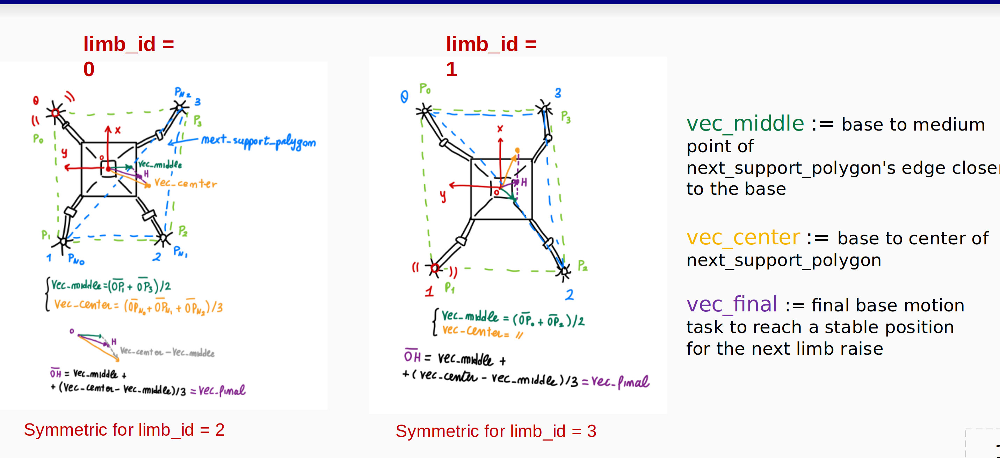
>


### LIMBERO AND GRIEEL 

When using the real robot, commands for base,limb and grieel motions are the same as before. The launch file is different: 

* **WHEEL MODE**
  
```bash
# First Terminal
ros2 launch ~/lbr_ws/src/LIMBERO/TOOLS/LAUNCH/limbero.launch.py wheel_mode:=true
```
( you can omit `wheel_mode:=true`, it is the default option)

* **GRIPPER MODE**
  
```bash
# Second Terminal
ros2 launch ~/lbr_ws/src/LIMBERO/TOOLS/LAUNCH/limbero.launch.py wheel_mode:=false
```
(again, in this case you must specify `wheel_mode:=true`)

> [!NOTE]
> * When working with the real robot, there is no need to start with INITIALIZATION command. That initial limitation is only a Simulation related problem.

> [!IMPORTANT]
> * Be sure of changing in `lbr_high_level_controller`, the related SIMULATION variable to false.
>   ```cpp
>    #define SIMULATION false
>   ```
>   This is important because it is related to how grieel automatic transition algorithm is executed. In fact when real robot is in use, wristH, wristV, driving and locking are actuated during the algorithm, by using the related grieel command explained before.
> * If contact sensor will not be included in robot feet, support polygon is not known online and the algorithm cannot even start. There are some publisher and subscriber called as "fake" contact sensor and so on commented in the code (just search for "fake" in VSC. uncomment it to send fake information about contact, based on the knowledge about motion tasks sent.

As before, to send commands to limbero by Joypad or command line (opening a third terminal), open a second terminal and run `lbr_command_interface` node.

```bash
# Second terminal
ros2 run lbr_command_interface lbr_command_interface
```

At this point if everything works properly and red ligths of each motor switch on, you are ready to use the command explained before. The changes are in the underlining comunication. In fact when using real robot, ros2_control is no more used, the joint trajectory are directly sent to `lbr_dynamixel_controller`, which is responsable for the position/velocity command. The joint control is responsability of the dynamixel motor itself (the tuning of those controllers gain is done by changing the PID gain in `~/lbr_ws/src/LIMBERO/CONTROL/lbr_dynamixel_control/config/PIDGains.csv`).

for further Experimental information when using GRIEEL, refer to [Grieel Stable Trasformation esa](https://srl.esa.io/posts/632) page (remember to login with Tohoku google accound). On that page, several hardware related problems and improvement idea are summarized.
Also, some comments related to the current software implementation and hardware problem can be found in the final section [Comments](#comments)

---

## SOFTWARE UPDATE

### Code Directory Structure

The overall ROS2 code is structured in grouped packages, accordingly to common functionality. Below is the Directory structure.
New packages have [N!] while the one just modifyed have [M] after package name.

```bash
LIMBERO
├── CONTROL  # Contains packages related control
│   ├── lbr_dynamixel_controller [M]
│   ├── lbr_high_level_controller [M]
│   ├── lbr_limb_controller [M]
│   └── lbr_low_level_controller [M]
├── PARAM # Contains packages related to robot description and custom messages
│   ├── grieel_sim_runtime_update [N!]
│   ├── lbr_description [M]
│   ├── lbr_msgs [M]
│   └── lbr_parameter.hpp [M]
├── images [N] #collection of images for README.md documentation
├── PLANNER  # Contains packages related planning
│   └── lbr_grasping_guarantee
├── README.md
├── SLAM  # Contains packages related SLAM
│   ├── lbr_contact_determination
│   ├── lbr_state_estimator [M]
│   └── SENSOR
├── SUBMODULE  # Submodule repositories
│   ├── DynamixelSDK
│   └── rt_usb_9axisimu_driver
└── TOOLS # set of tools for robot interface 
    ├── CONFIG
    ├── LAUNCH [M] # ROS 2 launch files
    ├── lbr_command_interface [M]
    ├── lbr_data_analysis [N!]
    ├── lbr_sim [M]
    └── SETUP_SCRIPT
```

### Description of updates and new packages

Sevral packages required update to control Grieel joints. Below a brief description of updated packages, with related update is explained.
The [next section](#grieel-related-comunication) instead try to explain better how new Grieel comunication works.

* **CONTROL**
  * **lbr_high_level_controller**
       map user command to low level messages in terms of base and limb task. Is also responsible for other high level functionalities like checking if base center is inside support polygon received from lbr_state_estimator

    :green_square: New Grieel commands are mapped with set of base/motion tasks, some Grieel joints actuation is also performed here accordingly to the user command (a better implementation should require to define some custom Grieel task and an additional package for managing Grieel joints, but my plan is to consider wristH,wristV as part of limb joints and not separately. Grieel transition algorithm high level commands and logic are written here separating it in 2 methods, a full algorithm function and a single limb transition. In this way the algorithm is easy to modify accordingly to necessity

  * **lbr_low_level_controller**

      map low level command to limb command, as end effector position of each limb. Received a base task in terms of xyz, rpy this node map it to required end-effector position using geometrical computation, similarly from a single limb task it publish the end-effector sequence of positions. This end-effector trajectory is properly fitted using the initial pose, final and a middle pose if defined, using a 7 degree polynomius trajectory.

     :green_square: Added some callback function here to map high level Grieel command as single limb command accordingly to the specified limb_id

  * **lbr_limb_controller**

       Single limb controller, received the end-effector trajectory step by step rely on inverse kinematic (from end-effector desired position find joint state required angle) to map this into the required joints state, needed for actuating the motors. Also use direct (forward) kinematic to update at runtime the current joint state (when encoder information is not available, so in simulation). So it is the lower level part of the controller before the hardware actuation

      :green_square: As in other nodes, joints updated including Grieel ones, also in terms of upper/lower limits. Grieel trajectory received from low_level is here collected in the overall limb joint state than used by lbr_sim. At this point inverse kinematic is update considering a fixed Grieel joint angle accordingly to the state of an internal parameter that keep track of the state of the module. This is a simplification due to the complexity of solving inverse kinematic


  * **lbr_dynamixel_controller**
       In principle, commands computed by ros2_control can be mapped directly to the motors, but this require the definition of an hardware interface, which is not straight forward. That’s why at the current state of the Software architecture, motor commands are sent by this additional node, responsible of writing each lbr_limb_controller joint state to the correct port where the motor is attached, and reading the encoder state. To write this functionality the library dynamixel_sdk has been used, written directly by ROBOTIS to control Dynamixel motors

       :green_square: This code again is updated with the new joints, plus other update due to the different control of driving and locking motors, which are controlled at velocity level (respect the others at position level). Additional methods to read and write velocity have been written, and also reading current become useful as we see later on. Also due to the fact that I proceed with a retuning of Dynamixel PID gains, a method to write in the correct address the new gains when dynamixel are setted-up is needed. Finally a method to control the locking mechanism of GRIEEL has been implemented. This consider a difference into the amount of motor rotations in order to know when the Module reach the proper tension/release in the two modes. The choice of the angle depends on how much fingers' joints are usurated, so it is not so robust. Anyways as prototype it seems to work.
    
  
* **PARAM**
  
  * **lbr_description**

    collection of the robot model description, in terms of mesh (3D representation of the links) and URDF (Unified Robot Descriptive Format), which is a standard way to define how links are interconnected by joints using xml format. Also URDF contains information useful for Gazebo simulation (like physical parameters) and other plug-in. This description is useful not only during simulation but also for rviz2 to have a real-time visualization of the robot in the screen, looking at the evolution of each reference frame and with possibility of visualizing additional useful information. To keep URDF clean, this is written using the xacro formatting method, that allow to divide the xml overall description in multiple file (and also use some variables and macro-functions) that later on xacro program will merge in a single one. Also ros2_control set-up parameters are defined inside a xacro file and ros2 controller gains in a yaml configuration file.
    
     :green_square: URDF of GRIEEL is needed to simulate LIMBERO+GRIEEL, my project mate Kohta Naoki make the mesh and URDF of wheel and gripper mode for Grieel. Also URDF has to manage which Grieel Mode we want to load, so using xacro syntax I set-up some if/else condition all over the different files. ros2_control related urdf is update with the new joints
    
  * **lbr_msgs**
       contains all  useful custom messages like limb task and base task (definition of xyz, rpy movement of base or end-effector).

      :green_square: Added some messages for management of Grieel state like a mode change message, that store the limb id and the new mode
      
    
* **SLAM**
  
  * **lbr_state_estimator**
    
    based on the overall joint state (collected by lbr_sim) , it is used for visualization purpose (publish each limb end-effector motion command as marker information for rviz2, a visualization tool used with ROS2). In order to send end effector state from joint one it rely on direct kinematic, which has the purpose of mapping joint state to end-effector (operation space) state, from the kinematic description of the manipulator (limb).
Another crucial function of this node is using the end effector position to estimate the support polygon of the robot (a geometrical entity which is crucial for stability analysis).

    :green_square: this node require an update on the overall list of the robot joints
    
* **TOOLS**
   * **lbr_command_interface**
   
       used to send high level commands to the robot, like moving the base or end- 
       effector in a specific way. Those commands can be sent by joystick (buttons 
       mapped properly) or by command line.

       :green_square: additional commands like single Grieel module transition, all 
        module transition algorithm,  driving, etc needs to be mapped

   * **lbr_sim**
    
        When in simulation, it maps single limb state (contact and configuration) to a whole   joint state, for easier management of it. If          real robot, it
      collects into a single data structure the overall motors encoder state. Also, after collecting the joints, it is responsible of  
      publishing it to the joint_trajectory_controller node, established by ros2_control, in the proper topic.

      :green_square: additional wristH, wristV, driving DOF pf each limb has to be  
      included

  * **LAUNCH**
    
    It is not a real package but a collection of python launcher for different  
    functionality.

    :green_square: several launcher modified to store the initial configuration of GRIEEL when program is launched, and stored into internal node parameters. This information is useful also in the simulation environment to load the correct model.
  * **lbr_data_analysis**
    
    It is a new package that I implement for trajectory traking performance analysis. It consist of a Python node that save joint command and feedback in a csv file, and a python script that launched with the csv file name plot the data in a graph easy to interpret (reference vs real). This can be done with plotjuggler, but simple modification on this node allow more freedom of visualization.

### GRIEEL Related comunication 

The software structure treat GRIEEL as part of the limb itself, and not as a separate end-effector entity. So all the related code and pub/sub is part of the already existing CONTROL packages. In previous section some hint on code updates is given, now more detailed explanation on nodes comunication will be explained. 

The following comunication dynamics are related to the commands explained in the [SIMULATION](#simulation) section, which starts a chained pub/sub sequence among CONTROL packages nodes.

**SINGLE GRIEEL MODULE TRASFORMATION**

Figure below show all the comunications that occurs when `lbr_high_level_control` publish a command for trasforming one of GRIEEL module.
This command can be send by the user as explained in the Tutorial [SIMULATION](#simulation) section.
(HLC = high level controller , LLC=low level controller , LC = limb controller , DC= Dynamixel controller) 
The idea is that the HLC is responsable for deciding when Grieel trasfromation should start, then LLC receive the custom message (defined in `lbr_msgs`) of type `lbr_msgs::msg::GrieelModeChange`. This message contain information about the id of the relative limb and the new mode.

LIMBERO/PARAM/lbr_msgs/msg/
GrieelModeChange.msg
```cpp
   #std_msgs/Header header
   int64 limb_id  # LF = 0, LH = 1, RH = 2, RF = 3
   string mode # wheel, gripper
```

Then, according to limb_id, LLC publish the new state to the related LC, which compute Grieel joint trajectory for the trasformation (this joint trajectory publish is omitted below, its part of the already implemented code related to joint trajectory control, with the new joints). When joint commmands finish and grieel wrist configuration is in the correct pose, LC comunicate it to its limb related DC, responsable for controlling the locking motor which roll up or release the wire for Gripper/Wheel trasformation.
Finally, when DC knows that the wires are fully in tension(Wheel) or released (Gripper), a feedback signal is sent to HLC which need the knowledge of it to chose the next task. 
FOr example, in the automatic algorithm, after single module trasformation, a swing down limb motion can start.

Comunication chain for GRIEEL module trasformation

> 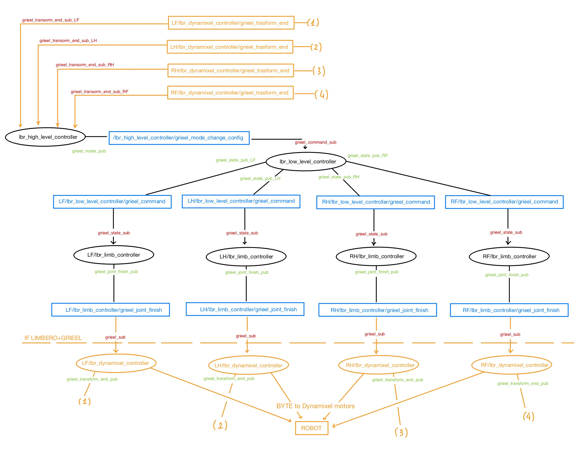

**GRIEEL MODULE DRIVE/STOP and DRIVING/STANDARD CONFIGURATION**

In this case the idea is that from `lbr_command_interface` (so from a user command on the `/string` topic), the string message is received by HLC. HLC then publish an integer number related to the received command, this is comunicated to LLC which then send it to the correct LC (in this prototype version of the code, LLC select the target limb with an if check on the integer message received, for example 100 is driving all, -1 is stop all, 0 is driving forward config LF, 10 is standard config LF and so on.. look into `lbr_high_level_controller` for further details).At this point LC can comuincate it as joint trajectory command, which is directly received by the trajectory controller (or by dynamixel controller if robot is used).
The feedback about driving joint can be directly accesed as part of the joint states (from gazebo or dynamixel encoders). 
So, the comuincatiion sequence is very similar to the one related to grieel trasformation, It is possible to see the ros2 graph of comunication with the usual command `rqt_graph`. The logic behind is similar to the one of the previous figure.

**TRASNFORMATION ALGORITHM ETC.**
Regarding the other part of the update, the comunication structure of motion task/package and joint control already existing is used. The algorithm for automatic trasformation logic has been already explained above, and it is implemented using both new and exixsting features. 

---

## New Table of Dynamixel IDs

Labeled Number is defined for each Dynamixel in Limb team, and it is different from assigned ID that is used for Dynamixel recognition.
(GRIEEL Dynamixel motors not yet labeled)
| Limb | Which part? | Dynamixel model number | Labeled No.# | Assigned ID | Control mode |
|------|-------------|------------------------|---------------|-------------|-----|
| LF   | B2C         | XM540-W270-R           | #10           | 1           | Position |
| LF   | C2F         | XM540-W270-R           | #18           | 2           | Position |
| LF   | F2T         | XM430-W350-R           | #11           | 3           | Position |
| LF   | T2G         | XM430-W350-R           | #12           | 4           | Position |
| LF   | wristH      | 2XL430-W250-T          | #?            | 5           | Position |
| LF   | wristV      | 2XL430-W250-T          | #?            | 6           | Position |
| LF   | driving     | XM430-W350-R           | #?            | 7           | Velocity |
| LF   | Locking     | XL430-W250-T           | #?            | 8           | Velocity |
| LH   | B2C         | XM540-W270-R           | #24           | 9           | Position |
| LH   | C2F         | XM540-W270-R           | #25           | 10          | Position |
| LH   | F2T         | XM430-W350-R           | #28           | 11          | Position |
| LH   | T2G         | XM430-W350-R           | #27           | 12          | Position |
| LH   | wristH      | 2XL430-W250-T          | #?            | 13          | Position |
| LH   | wristV      | 2XL430-W250-T          | #?            | 14          | Position |
| LH   | driving     | XM430-W350-R           | #?            | 15          | Velocity |
| LH   | Locking     | XL430-W250-T           | #?            | 16          | Velocity |
| RH   | B2C         | XM540-W270-R           | #22           | 17          | Position |
| RH   | C2F         | XM540-W270-R           | #23           | 18          | Position |
| RH   | F2T         | XM430-W350-R           | #30           | 19          | Position |
| RH   | T2G         | XM430-W350-R           | #9            | 20          | Position |
| RH   | wristH      | 2XL430-W250-T          | #?            | 21          | Position |
| RH   | wristV      | 2XL430-W250-T          | #?            | 22          | Position |
| RH   | driving     | XM430-W350-R           | #?            | 23          | Velocity |
| RH   | Locking     | XL430-W250-T           | #?            | 24          | Velocity |
| RF   | B2C         | XM540-W270-R           | #20           | 25          | Position |
| RF   | C2F         | XM540-W270-R           | #21           | 26          | Position |
| RF   | F2T         | XM430-W350-R           | #26           | 27          | Position |
| RF   | T2G         | XM430-W350-R           | #29           | 28          | Position |
| RF   | wristH      | 2XL430-W250-T          | #?            | 29          | Position |
| RF   | wristV      | 2XL430-W250-T          | #?            | 30          | Position |
| RF   | driving     | XM430-W350-R           | #?            | 31          | Velocity |
| RF   | Locking     | XL430-W250-T           | #?            | 32          | Velocity |

---

## COMMENTS

### Needed future improvements

#### HARDWARE

* In order to use Grieel module in LIMBERO, mechanical upgrade are needed. Even if Grieel will be lighter, LIMBERO limb are designed for climbing, walking and wheeled-legged driving may be difficult with the current joint motors. A redesign of LIMBERO joints with stronger C2F and F2T joint may be required for uneven terrain navigation. Even considering to use stronger motors than Dynamixel can be an option (in that case, low level software update for motor control will be the next issue).

* Grieel locking mechanism control is not robust, as explained in the [SW Update](#description-of-updates-and-new-packages) `lbr_dynamixel_control` section, the W2G and G2W trasformation control require an improvement.
    * Sensors on Grieel fingers can help to understand if the Gripper or Wheel mode is reached.
    * Grieel locking wire tension feedback also can allow to identify the state of the module.
Next GRIEEL verison should include this new functionality to develop any automatic task execution.

* Robust contact sensors that can send feedback on feet contact both in Gripper and Wheel mode are foundamental for gait execution and any autonomous task.
  

#### SOFTWARE

* Notice that this code is written for the first GRIEEL harware. 
When new Grieel will be available (without WirstV joint and new mechanism on the base for lightweight module), this code will become obsolete in some parts. 
Then, some changes may be needed for simulation and control of new Grieel version.

* Kinematic update also is important. The code up to now use the same analytical solution used for LIMBERO leg (an analytical solution with the new Grieel DOF is very complex).
This semplification seems to work, but for sure introduces control errors and inaccuracy also in the estimation of the support polygon (computed using forward kinematic).
Forward kinematic update for limbero with grieel is feasible, but inverse kinematic is much more complex, and may require posture or optimization criteria to chose among all the possible solutions. Thinking about well know Newton-Raphson recursive method for inverse kinematic solution is a possibility.
Doing this directly on the upcoming Grieel module and Limbero leg redesign is a must.

* An interface between ros2_control and dynamixel has to be implemented. Rigth now joint trajectory is directly used by lbr_dynamixel controller that write joint state to the dynamixel, and then low level dynamixel position/speed control acts. The commands computed by PID joint_trajectory ros2_controller is not used in the real experiments, but only during Gazebo simulation. To solve this issue and use high level controllers, a "connection" between ros2_control and hardware motors with a software interface is the solution.

* This Software architecture idea is to consider GRIEEL as part of the limb, so as an extension of limb joint. In this way the joint state of Grieel are grouped toghether with the already existing one, and all the updates related to Grieel control and comunication are introduced in the already existing CONTROL packages.
During implementation it was clear that some aspect of Grieel may be detached from limb control, and treat it as a separate entity could improve code reusability (In order to use Grieel in other legged robot). Unfortunately due to time constraints, this version of the code is written in order to be able to control the module with the existing software.
In future, implementing Grieel related packages like a `grieel_high_level_command`, `grieel_low_level_command`, etc. is needed, especially considering the flexibile working conditions of GRIEEL. A well written indipendent code for driving, climbing, transforming, manipulating and also adaotable to any type of limb is a crucial future objective. This doesn't mean that this code is all to be thrown away, but using the knowledge aquired from this project, new results can be reached.

### Updoming updates

* New indipendent joint controller node implementation. Ros2_control use a simple PID position feedback control, and implementing custom controller is possible but not easy. Soon a new node implementing a cascade control (inner velocity loop and outer position loop) will be implemented, and tuned accordingly to a simplifyed dynamic model of the robot, considering each limb as an indipendent manipulatr. For modelling and control tuning, the indipendent joint control theory and servomechanism modelling will be used.
  
* Identification of the expression of gravitational tensor of each limb is needed to include a gravity compoensation term, which make the controller more robust against disturbances. The idea is to use some analytical formulation to fing g(q) as a 7-variable function, or to comupte in a MATLAB simulation g(q) in several configuartion and fit the data obtaining a continuous function.

* Performance evaluation of the automatic trasformation algorithm will be done, to compare why the base motion vetor is better than simply move to the center of the 3-feet support polygon. This evaluation will be sone using manipulator dexterity and performances indices, with the possibility of improving the algorithm and imporving it.


# LIMBERO & GRIEEL with INDIPENDENT JOINT CONTROLLER

Tentative LIMBERO branch, to implement a joint controller from scratch, without using ros2_control JointTrajectoryController.

For the complete LIMBERO+GRIEEL Readme, look [here](https://github.com/AlePuglisi/LIMBERO/blob/jointTrajectoryController/README.md)
